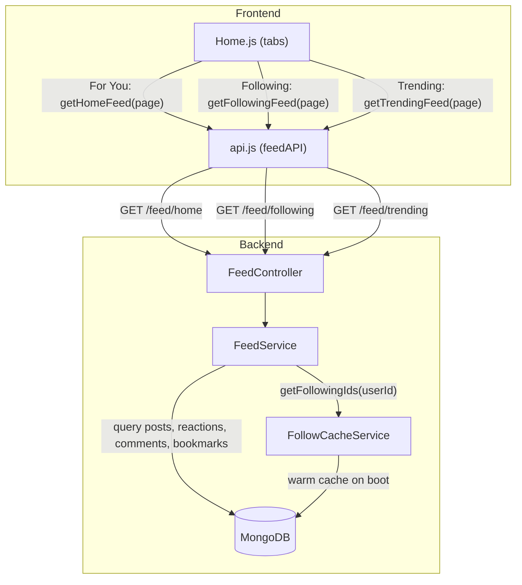

# Design Document: Home Feed Tabs

## Overview

This design adds two new backend feed endpoints (`GET /feed/following`, `GET /feed/trending`) and wires the existing three-tab Home page so each tab calls its own endpoint. The **For You** tab remains unchanged. The **Following** tab filters posts to users the requester follows (via `FollowCacheService`). The **Trending** tab ranks posts from the last 7 days by engagement score (reaction count + comment count).

Both new endpoints reuse the existing post-enrichment pipeline (author info, reactions, comments, bookmarks, canDelete) so the frontend `PostCard` component works identically across all tabs.

On the frontend, two new API methods (`getFollowingFeed`, `getTrendingFeed`) are added to the API service, and `Home.js` is updated so each tab triggers the correct query key and fetch function. The Following tab also gets a dedicated empty-state component when the user follows nobody.

## Architecture



### Request Flow

1. **Following Feed**: `Home.js` → `feedAPI.getFollowingFeed(page)` → `GET /feed/following?page=N&userId=X` → `FeedController.getFollowingFeed()` → `FeedService.getFollowingFeed()` → `FollowCacheService.getFollowingIds(userId)` → Mongoose query with `userId: { $in: followingIds }` → enrich → respond.

2. **Trending Feed**: `Home.js` → `feedAPI.getTrendingFeed(page)` → `GET /feed/trending?page=N&userId=X` → `FeedController.getTrendingFeed()` → `FeedService.getTrendingFeed()` → Aggregation pipeline: filter by `createdAt >= now - 7d`, compute engagement score via `$lookup` on reactions + comments, `$sort` by score desc then `createdAt` desc → enrich → respond.

3. **For You Feed**: Unchanged. `feedAPI.getHomeFeed(page)` → `GET /feed/home` → existing `FeedService.getHomeFeed()`.

## Components and Interfaces

### Backend

#### FeedController (modified)

New route handlers added to the existing controller:

```typescript
// New endpoints
@Get('following')
async getFollowingFeed(
  @Query('page') page: number = 1,
  @Query('userId') userId: string,
): Promise<FeedResponse>

@Get('trending')
async getTrendingFeed(
  @Query('page') page: number = 1,
  @Query('userId') userId?: string,
): Promise<FeedResponse>
```

- `GET /feed/following` — requires `userId` query param; returns 400 if missing.
- `GET /feed/trending` — `userId` is optional (unauthenticated users see trending without personalized reactions/bookmarks).

#### FeedService (modified)

Two new methods:

```typescript
async getFollowingFeed(page: number, userId: string): Promise<FeedResponse>
async getTrendingFeed(page: number, userId?: string): Promise<FeedResponse>
```

**`getFollowingFeed`** logic:
1. Call `followCacheService.getFollowingIds(userId)` → `string[]`.
2. If empty, return `{ posts: [], page, hasMore: false }`.
3. Query `postModel.find({ userId: { $in: followingIds } }).sort({ createdAt: -1 }).skip(skip).limit(10)`.
4. Enrich each post (same pipeline as `getHomeFeed`).

**`getTrendingFeed`** logic:
1. Compute cutoff date: `new Date(Date.now() - 7 * 24 * 60 * 60 * 1000)`.
2. Use MongoDB aggregation pipeline:
   - `$match`: `createdAt >= cutoffDate`.
   - `$lookup` from `reactions` collection on `postId` (as string of `_id`) → count.
   - `$lookup` from `comments` collection on `postId` → count.
   - `$addFields`: `engagementScore = reactionCount + commentCount`.
   - `$sort`: `{ engagementScore: -1, createdAt: -1 }`.
   - `$skip` / `$limit` for pagination.
3. Enrich each post (same pipeline as `getHomeFeed`).

**Shared enrichment** — The existing enrichment logic (author lookup, reaction counts, user reaction, comment count, bookmark status, canDelete) is already duplicated across `getHomeFeed`, `getReelsFeed`, and `getExploreFeed`. The new methods will reuse the same pattern. A private `enrichPosts(posts, userId)` helper method should be extracted to eliminate duplication.

```typescript
private async enrichPosts(
  posts: PostDocument[],
  userId?: string,
  currentUserRole?: string,
): Promise<EnrichedPost[]>
```

#### FeedModule (modified)

Import `FollowModule` so `FollowCacheService` is injectable into `FeedService`:

```typescript
@Module({
  imports: [
    MongooseModule.forFeature([...]),
    FollowModule,  // NEW — provides FollowCacheService
  ],
  controllers: [FeedController],
  providers: [FeedService],
})
export class FeedModule {}
```

#### FollowModule (unchanged)

Already exports `FollowService` and `FollowCacheService`. No changes needed.

### Frontend

#### API Service (`api.js`) — new methods

```javascript
// Inside feedAPI object
getFollowingFeed: (page = 1) => {
  const user = getUserData();
  return api.get(`/feed/following?page=${page}${user?.userId ? `&userId=${user.userId}` : ''}`);
},
getTrendingFeed: (page = 1) => {
  const user = getUserData();
  return api.get(`/feed/trending?page=${page}${user?.userId ? `&userId=${user.userId}` : ''}`);
},
```

#### Home.js (modified)

- Map each tab ID to its fetch function:
  - `'for-you'` → `feedAPI.getHomeFeed`
  - `'following'` → `feedAPI.getFollowingFeed`
  - `'trending'` → `feedAPI.getTrendingFeed`
- The `useInfiniteQuery` key already includes `activeTab`, so switching tabs triggers a fresh fetch.
- Add a `FollowingEmptyState` component shown when the Following tab returns zero posts, with a message like "You're not following anyone yet" and a link to the Explore page or search.

### Response Contract

All three feed endpoints return the same shape:

```typescript
interface FeedResponse {
  posts: EnrichedPost[];
  page: number;
  hasMore: boolean;
}

interface EnrichedPost {
  _id: string;
  userId: { userId: string; username: string; profilePhotoUrl: string | null };
  content: string;
  type: 'text' | 'image' | 'gif';
  mediaUrl?: string;
  hashtags: string[];
  createdAt: string;
  updatedAt: string;
  reactions: Record<string, number>;  // e.g. { love: 3, laugh: 1 }
  userReaction: string | null;
  commentCount: number;
  isBookmarked: boolean;
  canDelete: boolean;
  likeCount: number;   // backward compat: sum of all reactions
  isLiked: boolean;    // backward compat: true if userReaction === 'love'
}
```

## Data Models

No new collections or schema changes are required. The feature operates on existing collections:

| Collection   | Key Fields Used                                      | Purpose                                    |
|-------------|------------------------------------------------------|--------------------------------------------|
| `posts`     | `_id`, `userId`, `content`, `type`, `mediaUrl`, `hashtags`, `createdAt` | Source documents for all feeds              |
| `users`     | `userId`, `username`, `profilePhotoUrl`, `role`      | Author enrichment, admin check             |
| `reactions` | `postId`, `userId`, `type`                           | Reaction counts, user reaction, engagement score |
| `comments`  | `postId`, `userId`, `text`                           | Comment count, engagement score            |
| `bookmarks` | `postId`, `userId`, `postAuthorId`                   | Bookmark status                            |
| `follows`   | `followerId`, `followingId`                          | Follow cache warm-up (cache used at runtime) |

### Index Considerations

The trending feed aggregation pipeline filters by `createdAt` and joins on `postId` in both `reactions` and `comments`. Existing indexes should be verified:

- `posts.createdAt` — needed for the `$match` stage. If not indexed, add `{ createdAt: -1 }`.
- `reactions.postId` — needed for the `$lookup`. Should already exist or be added.
- `comments.postId` — needed for the `$lookup`. Should already exist or be added.

The following feed query uses `posts.userId` with `$in`, which benefits from an index on `{ userId: 1, createdAt: -1 }`.

## Correctness Properties

*A property is a characteristic or behavior that should hold true across all valid executions of a system — essentially, a formal statement about what the system should do. Properties serve as the bridge between human-readable specifications and machine-verifiable correctness guarantees.*

### Property 1: Following feed returns only followed users' posts

*For any* user with a non-empty follow list and any set of posts in the database, every post returned by `getFollowingFeed` SHALL have a `userId` that is contained in the set returned by `getFollowingIds(requestingUserId)`.

**Validates: Requirements 1.3**

### Property 2: Following feed chronological ordering

*For any* set of posts returned by `getFollowingFeed`, for every consecutive pair of posts `(posts[i], posts[i+1])`, `posts[i].createdAt >= posts[i+1].createdAt` SHALL hold.

**Validates: Requirements 1.4**

### Property 3: Trending feed time-window filtering

*For any* set of posts in the database with varying `createdAt` timestamps, every post returned by `getTrendingFeed` SHALL have a `createdAt` that is within the last 7 days from the time of the request, and no post older than 7 days SHALL appear in the results.

**Validates: Requirements 3.2**

### Property 4: Trending feed engagement score correctness

*For any* post returned by `getTrendingFeed`, its computed engagement score SHALL equal the sum of the total reaction count (across all reaction types) and the total comment count for that post.

**Validates: Requirements 3.3**

### Property 5: Trending feed engagement-based ordering with tiebreaker

*For any* set of posts returned by `getTrendingFeed`, for every consecutive pair `(posts[i], posts[i+1])`, either `engagementScore[i] > engagementScore[i+1]`, or `engagementScore[i] == engagementScore[i+1]` and `posts[i].createdAt >= posts[i+1].createdAt` SHALL hold.

**Validates: Requirements 3.4**

### Property 6: Feed pagination invariant

*For any* feed endpoint (following, trending, or home) and any page number, the number of posts returned SHALL be at most 10, and requesting page N SHALL skip exactly `(N-1) * 10` posts from the full ordered result set.

**Validates: Requirements 1.5, 3.5**

### Property 7: Post enrichment completeness

*For any* post returned by any feed endpoint (following, trending, or home), the enriched post SHALL contain: (a) author `username`, `profilePhotoUrl`, and `userId`; (b) a `reactions` object with counts grouped by type that matches the actual reaction documents; (c) a `commentCount` that matches the actual comment document count; (d) a `userReaction` that is the requesting user's reaction type or null; (e) an `isBookmarked` flag that is true only when a bookmark exists and the post author differs from the requesting user; and (f) a `canDelete` flag that is true only when the requesting user is the post author or has admin role.

**Validates: Requirements 2.1, 2.2, 2.3, 2.4, 2.5, 2.6, 4.1, 4.2, 4.3, 4.4, 4.5, 4.6**

### Property 8: Home feed returns all posts without filtering

*For any* set of posts in the database, `getHomeFeed` SHALL return posts from all users (no filtering by follow status or engagement score), sorted by `createdAt` descending, preserving the existing behavior.

**Validates: Requirements 9.1**

## Error Handling

| Scenario | Endpoint | Behavior |
|----------|----------|----------|
| Missing/empty `userId` on following feed | `GET /feed/following` | Return HTTP 400 with `{ message: "userId query parameter is required" }` |
| User follows nobody | `GET /feed/following` | Return `{ posts: [], page: 1, hasMore: false }` (not an error) |
| No posts within trending window | `GET /feed/trending` | Return `{ posts: [], page: 1, hasMore: false }` (not an error) |
| Page number out of range | All feed endpoints | Return `{ posts: [], page: N, hasMore: false }` |
| Post author not found in users collection | All feed endpoints | Fall back to `{ userId: post.userId, username: 'Unknown User', profilePhotoUrl: null }` (existing behavior) |
| FollowCacheService unavailable | `GET /feed/following` | Let NestJS propagate the error as HTTP 500 (dependency injection failure is a server error) |
| MongoDB query failure | All feed endpoints | Catch and log error, return HTTP 500 with generic message |

## Testing Strategy

### Property-Based Tests (fast-check)

The project uses TypeScript on the backend (NestJS). Property-based tests will use **fast-check** as the PBT library.

Each correctness property maps to a single property-based test with a minimum of 100 iterations. Tests will use in-memory mocks for MongoDB models and FollowCacheService to keep execution fast.

**Configuration:**
- Library: `fast-check` (npm package)
- Minimum iterations: 100 per property
- Tag format: `Feature: home-feed-tabs, Property N: <property text>`

**Property test targets:**
| Property | Test Description |
|----------|-----------------|
| 1 | Generate random follow lists and post sets, verify filtering |
| 2 | Generate random posts with random timestamps, verify sort order |
| 3 | Generate posts with dates inside/outside 7-day window, verify filtering |
| 4 | Generate posts with random reaction/comment counts, verify score |
| 5 | Generate posts with random scores and timestamps, verify sort |
| 6 | Generate varying post counts and page numbers, verify pagination |
| 7 | Generate posts with random enrichment data, verify all fields |
| 8 | Generate random posts, verify no filtering on home feed |

### Unit Tests (Jest)

Example-based tests for specific scenarios and edge cases:

- **Controller routing**: Verify `GET /feed/following` and `GET /feed/trending` call correct service methods
- **400 validation**: Missing `userId` on following endpoint returns 400
- **Empty follow list**: Following feed returns empty array with `hasMore: false`
- **Frontend API methods**: `getFollowingFeed(page)` and `getTrendingFeed(page)` call correct URLs
- **Tab routing**: Each tab triggers the correct API method
- **Tab switching**: Switching tabs triggers a fresh query
- **Following empty state**: Empty following feed shows distinct empty-state UI
- **Home feed preservation**: `GET /feed/home` still works with unchanged contract

### Integration Tests

- **End-to-end feed flow**: Seed MongoDB with test data, call each endpoint, verify response shape and content
- **Module wiring**: Verify FeedModule successfully imports FollowModule and FeedService receives FollowCacheService
- **Pagination across endpoints**: Verify consistent pagination behavior across all three feed endpoints

