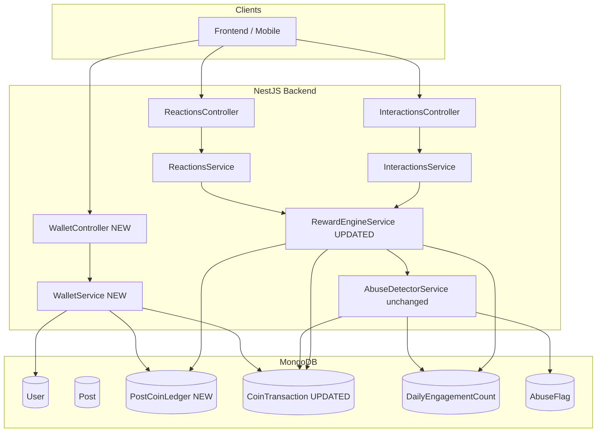

# Design Document: Per-Post Coin Rewards

## Overview

This feature changes the coin accumulation model from a single global `coinBalance` on the `User` document to a per-post ledger. Coins are tracked independently for each post. A post must accumulate at least **1,000 coins** before those coins become withdrawable by the post owner. Posts that never reach the threshold contribute only to a "pending" balance that is visible but not withdrawable.

The existing `CoinTransaction` history is preserved and extended. The global `coinBalance` field on `User` is deprecated in favour of a derived `withdrawableBalance` computed from the new `PostCoinLedger` collection. The `RewardEngineService` and a new `WalletService` are the two primary backend services involved.

### Key Design Decisions

- **Additive schema change**: The `PostCoinLedger` collection is new. The `User.coinBalance` field is kept but no longer written to by the reward engine; it will be ignored by the wallet summary. This avoids a destructive migration.
- **Atomic updates via MongoDB `$inc` + `findOneAndUpdate`**: The same pattern already used for `User.coinBalance` is applied to `PostCoinLedger.coinBalance`, satisfying the atomicity requirement.
- **Derived withdrawable balance**: `withdrawableBalance` is not stored redundantly on the user; it is computed on-demand by aggregating `PostCoinLedger` records where `thresholdReached = true`. This keeps the ledger as the single source of truth.
- **Threshold event transaction**: When a post crosses 1,000 coins, a special `post_threshold_reached` `CoinTransaction` is created so the event is auditable.
- **Conversion is per-post**: A post's coins can be converted once. A `converted` flag on `PostCoinLedger` prevents double-conversion.

---

## Architecture



### Module Boundaries

| Module | Changes |
|---|---|
| `RewardsModule` | `RewardEngineService` updated; new `PostCoinLedger` schema added |
| `WalletModule` (new) | `WalletService` + `WalletController`; depends on `RewardsModule` schemas |
| `UsersModule` | No logic changes; `coinBalance` field kept but deprecated |
| `InteractionsModule` | No changes — calls `RewardEngineService` as before |
| `ReactionsModule` | No changes — calls `RewardEngineService` as before |

---

## Components and Interfaces

### RewardEngineService (updated)

The service gains a dependency on the new `PostCoinLedger` model. The core change is that `processEngagement` and `reverseEngagement` now write to `PostCoinLedger` instead of (or in addition to) `User.coinBalance`.

```typescript
// Updated EngagementEvent — no interface changes needed
export interface EngagementEvent {
  engagerId: string;
  postId: string;
  postOwnerId: string;
  eventType: 'like' | 'reaction';
  reactionType?: string;
}

// Updated RewardResult — adds postCoinBalance for callers that need it
export interface RewardResult {
  rewarded: boolean;
  reason?: string;
  engagerCoins?: number;
  ownerCoins?: number;
  transactions?: CoinTransaction[];
  postCoinBalance?: number;       // new: balance after this event
  thresholdJustReached?: boolean; // new: true if this event crossed 1,000
}
```

**`processEngagement` updated flow:**
1. Check engager is subscribed (unchanged)
2. Check post owner is subscribed (unchanged)
3. Run abuse detection (unchanged)
4. Atomically `$inc` `PostCoinLedger.coinBalance` by `OWNER_REWARD` (upsert)
5. Check if threshold was just crossed; if so, set `thresholdReached = true` and `thresholdReachedAt`
6. Create `CoinTransaction` with `postCoinBalanceAfter` field
7. If threshold just crossed, create additional `post_threshold_reached` transaction
8. Increment daily engagement count (unchanged)
9. **Do NOT write to `User.coinBalance`**

**`reverseEngagement` updated flow:**
1. Check if post is already `converted`; if so, return error `already_converted`
2. Atomically `$inc` `PostCoinLedger.coinBalance` by `-OWNER_REWARD`
3. If balance drops below threshold and `thresholdReached` was `true`, set `thresholdReached = false`
4. Create `CoinTransaction` with `eventType: 'engagement_reversed'` and negative amount

### WalletService (new)

```typescript
export interface WalletSummary {
  withdrawableBalance: number;
  pendingBalance: number;
  thresholdReachedPostCount: number;
  totalPostCount: number;
}

export interface PostEarning {
  postId: string;
  coinBalance: number;
  thresholdReached: boolean;
  thresholdReachedAt?: Date;
  converted: boolean;
}

export interface PaginatedPostEarnings {
  items: PostEarning[];
  total: number;
  page: number;
  pageSize: number;
}

export interface ConversionResult {
  success: boolean;
  convertedAmount: number;
  postId: string;
  transactionId: string;
}
```

**Methods:**
- `getWalletSummary(userId: string): Promise<WalletSummary>` — aggregates `PostCoinLedger`
- `getPostEarnings(userId: string, page: number, pageSize: number): Promise<PaginatedPostEarnings>`
- `convertPostCoins(userId: string, postId: string): Promise<ConversionResult>`
- `getTransactionHistory(userId: string, page: number, pageSize: number, relatedPostId?: string): Promise<PaginatedTransactions>`

### WalletController (new)

| Method | Route | Description |
|---|---|---|
| GET | `/wallet/summary` | Returns `WalletSummary` for the authenticated user |
| GET | `/wallet/posts` | Returns paginated `PostEarning[]` sorted by `coinBalance` desc |
| POST | `/wallet/convert/:postId` | Converts coins from a threshold-reached post |
| GET | `/wallet/transactions` | Paginated `CoinTransaction` history, optional `?postId=` filter |

---

## Data Models

### PostCoinLedger (new schema)

```typescript
@Schema({ timestamps: true })
export class PostCoinLedger {
  @Prop({ required: true, index: true })
  postId: string;

  @Prop({ required: true, index: true })
  ownerId: string;

  @Prop({ required: true, default: 0 })
  coinBalance: number;

  @Prop({ required: true, default: false })
  thresholdReached: boolean;

  @Prop()
  thresholdReachedAt: Date;

  @Prop({ required: true, default: false })
  converted: boolean;

  @Prop()
  convertedAt: Date;

  createdAt?: Date;
  updatedAt?: Date;
}
```

**Indexes:**
- `{ postId: 1 }` — unique, primary lookup
- `{ ownerId: 1, thresholdReached: 1 }` — wallet summary aggregation
- `{ ownerId: 1, coinBalance: -1 }` — per-post earnings list (sorted)

### CoinTransaction (updated schema)

Two additions to the existing schema:

```typescript
// New fields added to CoinTransaction
@Prop({ index: true })
relatedPostId: string; // already exists — no change

@Prop()
postCoinBalanceAfter: number; // NEW: post's balance after this transaction

// New eventType values added to the enum:
// 'post_threshold_reached' — emitted when a post crosses 1,000 coins
// 'conversion'             — already in enum, no change
```

Updated `eventType` enum:
```
'engagement_earned'       (existing — unused by current engine but kept)
'engagement_received'     (existing)
'engagement_reversed'     (existing)
'conversion'              (existing)
'post_threshold_reached'  (NEW)
```

### User (no schema changes)

The `coinBalance` field is kept as-is to avoid a breaking migration. The `RewardEngineService` stops writing to it. The `WalletService` ignores it. Frontend clients should migrate to the `/wallet/summary` endpoint.

---

## Correctness Properties

*A property is a characteristic or behavior that should hold true across all valid executions of a system — essentially, a formal statement about what the system should do. Properties serve as the bridge between human-readable specifications and machine-verifiable correctness guarantees.*

### Property 1: Per-post coin balance grows by exactly OWNER_REWARD on each eligible engagement

*For any* post and any eligible engagement event (both parties subscribed, abuse check passes), processing that engagement SHALL increment the `PostCoinLedger.coinBalance` for that post by exactly `OWNER_REWARD` coins.

**Validates: Requirements 1.1, 1.5**

---

### Property 2: Threshold flag is set if and only if coinBalance ≥ 1,000

*For any* `PostCoinLedger` record, the `thresholdReached` flag SHALL be `true` if and only if `coinBalance >= COIN_THRESHOLD (1000)`.

**Validates: Requirements 1.3, 1.4, 2.1, 2.2**

---

### Property 3: Engagement reversal is the exact inverse of engagement processing

*For any* post and any eligible engagement event, processing the engagement and then reversing it SHALL leave the `PostCoinLedger.coinBalance` unchanged from its value before the engagement was processed.

**Validates: Requirements 7.1, 7.4**

---

### Property 4: Withdrawable balance equals sum of threshold-reached post balances

*For any* user, the `withdrawableBalance` returned by `getWalletSummary` SHALL equal the sum of `coinBalance` across all `PostCoinLedger` records for that user where `thresholdReached = true`.

**Validates: Requirements 2.1, 2.3, 2.4**

---

### Property 5: CoinTransaction records are complete and well-formed

*For any* engagement event that results in a coin credit or debit, the created `CoinTransaction` record SHALL contain a non-empty `userId`, a non-zero `amount`, a valid `eventType`, a non-empty `relatedPostId`, and a `postCoinBalanceAfter` value that equals the `PostCoinLedger.coinBalance` after the transaction.

**Validates: Requirements 3.1, 3.2**

---

### Property 6: Conversion is idempotent — a converted post cannot be converted again

*For any* post whose coins have been converted, any subsequent conversion attempt SHALL return an error with reason `already_converted` and SHALL NOT modify the `PostCoinLedger` or create a new `CoinTransaction`.

**Validates: Requirements 4.4, 4.5**

---

### Property 7: Reversal on a converted post is rejected

*For any* post whose `converted` flag is `true`, a reversal attempt SHALL return an error with reason `already_converted` and SHALL NOT modify the `PostCoinLedger.coinBalance`.

**Validates: Requirements 7.5**

---

## Error Handling

| Scenario | HTTP Status | Error Reason |
|---|---|---|
| Convert coins from post where `thresholdReached = false` | 422 | `threshold_not_reached` |
| Convert coins from post already converted | 409 | `already_converted` |
| Reverse engagement on a converted post | 409 | `already_converted` |
| Wallet summary for non-existent user | 404 | `user_not_found` |
| Post not found during conversion | 404 | `post_not_found` |
| Post not owned by requesting user | 403 | `not_post_owner` |

**Atomicity failures**: MongoDB `findOneAndUpdate` with `$inc` is atomic at the document level. If the threshold-crossing logic (read-then-write on `thresholdReached`) races, the worst outcome is a duplicate `post_threshold_reached` transaction. This is mitigated by using `$set: { thresholdReached: true }` only when the returned document shows the balance just crossed the threshold (i.e., `coinBalance - OWNER_REWARD < COIN_THRESHOLD && coinBalance >= COIN_THRESHOLD`). The `{ new: true }` option on `findOneAndUpdate` returns the post-update document, making this check reliable.

**Reversal guard**: Before decrementing, `reverseEngagement` checks `PostCoinLedger.converted`. If `true`, it returns `already_converted` without touching the balance.

---

## Testing Strategy

### Unit Tests

Focus on specific examples and edge cases:

- `RewardEngineService.processEngagement` writes to `PostCoinLedger` (not `User.coinBalance`)
- Threshold flag is set when balance crosses 1,000
- `post_threshold_reached` transaction is created exactly once when threshold is crossed
- `reverseEngagement` rejects converted posts
- `WalletService.getWalletSummary` aggregates correctly for users with 0, 1, and many posts
- `WalletService.convertPostCoins` rejects `threshold_not_reached` and `already_converted`
- Transaction history pagination returns correct page/pageSize slices
- `postCoinBalanceAfter` field is populated on every transaction

### Property-Based Tests (fast-check)

The project already uses `fast-check` (v4.7.0). Each property test runs a minimum of **100 iterations**.

Tag format: `Feature: per-post-coin-rewards, Property {N}: {property_text}`

| Property | Test description |
|---|---|
| Property 1 | For any eligible engagement, `PostCoinLedger.coinBalance` increases by exactly `OWNER_REWARD` |
| Property 2 | For any sequence of engagements, `thresholdReached` ↔ `coinBalance >= 1000` |
| Property 3 | For any engagement followed by its reversal, net `coinBalance` change is zero |
| Property 4 | For any user with arbitrary post ledger state, `withdrawableBalance` equals sum of threshold-reached balances |
| Property 5 | For any engagement event, the resulting `CoinTransaction` is well-formed with all required fields |
| Property 6 | For any converted post, repeated conversion attempts always return `already_converted` |
| Property 7 | For any converted post, reversal always returns `already_converted` without modifying the balance |

### Integration Tests

- End-to-end: like a post 500 times (mocked engagers) → verify `thresholdReached` flips at exactly 1,000 coins
- Wallet summary endpoint returns correct `withdrawableBalance` and `pendingBalance` after mixed post states
- Transaction history endpoint supports `?postId=` filter correctly
