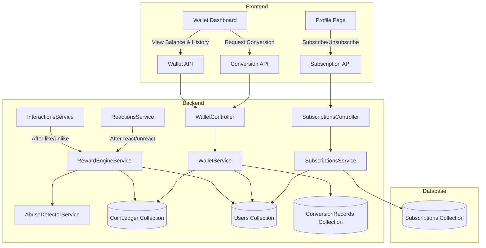
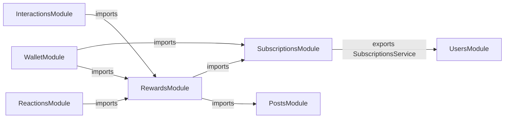

# Design Document: Subscription-Based Engagement & Rewards System

## Overview

This design introduces a subscription-based rewards system into the Flappy social media platform. The system adds three new backend modules (`subscriptions`, `rewards`, `wallet`) and corresponding frontend pages/components. When subscribed users engage with posts authored by other subscribed users, both parties earn coins. Coins accumulate in a ledger and can be converted to real money once eligibility thresholds are met. An abuse detection layer enforces rate limits, duplicate prevention, and engagement farming detection.

The design integrates with the existing NestJS backend (Mongoose/MongoDB), React frontend, and follows the established module patterns (controller → service → schema) already used by `posts`, `interactions`, `reactions`, and `users`.

### Key Design Decisions

1. **Separate modules over extending existing ones** — Subscription, Reward, and Wallet logic live in dedicated NestJS modules to avoid bloating `interactions` or `users`. Cross-module communication uses exported services.
2. **Coin Ledger as append-only log** — All coin changes are recorded as immutable transaction documents. The user's balance is a derived field on the User schema, updated atomically alongside ledger writes for read performance.
3. **Abuse detection as a service within the rewards module** — Rather than a standalone module, the `AbuseDetectorService` is co-located with the `RewardEngine` since it's only invoked during reward processing.
4. **Hook into existing engagement flow** — The `RewardEngine` is called from the existing `InteractionsService` and `ReactionsService` after a like/reaction is toggled, rather than duplicating engagement logic.

## Architecture



### Module Dependency Graph



## Components and Interfaces

### Backend Modules

#### 1. SubscriptionsModule (`flappy_BE/src/subscriptions/`)

**SubscriptionsController** — REST endpoints for subscription management.

| Endpoint | Method | Description |
|---|---|---|
| `/subscriptions/toggle` | POST | Toggle subscription status for authenticated user |
| `/subscriptions/status/:userId` | GET | Get subscription status for a user |

**SubscriptionsService** — Business logic for subscription state.

```typescript
interface SubscriptionsService {
  toggleSubscription(userId: string): Promise<SubscriptionResult>;
  isSubscribed(userId: string): Promise<boolean>;
  getSubscriptionStatus(userId: string): Promise<SubscriptionStatus>;
}

interface SubscriptionResult {
  isSubscribed: boolean;
  subscribedAt?: Date;
  unsubscribedAt?: Date;
}

interface SubscriptionStatus {
  isSubscribed: boolean;
  subscribedAt?: Date;
  coinBalance: number;
}
```

#### 2. RewardsModule (`flappy_BE/src/rewards/`)

**RewardEngineService** — Core reward calculation and distribution.

```typescript
interface RewardEngineService {
  processEngagement(event: EngagementEvent): Promise<RewardResult>;
  reverseEngagement(event: EngagementEvent): Promise<RewardResult>;
}

interface EngagementEvent {
  engagerId: string;
  postId: string;
  postOwnerId: string;
  eventType: 'like' | 'reaction';
  reactionType?: string;
}

interface RewardResult {
  rewarded: boolean;
  reason?: string; // Why no reward was given
  engagerCoins?: number;
  ownerCoins?: number;
  transactions?: CoinTransaction[];
}
```

**AbuseDetectorService** — Fraud prevention checks.

```typescript
interface AbuseDetectorService {
  checkEngagement(engagerId: string, postId: string, postOwnerId: string): Promise<AbuseCheckResult>;
  flagAccount(userId: string, reason: string): Promise<void>;
  isAccountFlagged(userId: string): Promise<boolean>;
}

interface AbuseCheckResult {
  allowed: boolean;
  reason?: string; // 'rate_limit' | 'duplicate' | 'self_engagement' | 'flagged'
}
```

#### 3. WalletModule (`flappy_BE/src/wallet/`)

**WalletController** — REST endpoints for balance, history, and conversion.

| Endpoint | Method | Description |
|---|---|---|
| `/wallet/balance` | GET | Get current coin balance for authenticated user |
| `/wallet/transactions` | GET | Get paginated transaction history |
| `/wallet/convert` | POST | Request coin-to-money conversion |
| `/wallet/thresholds` | GET | Get current threshold values |

**WalletService** — Balance queries and conversion logic.

```typescript
interface WalletService {
  getBalance(userId: string): Promise<number>;
  getTransactions(userId: string, page: number, limit: number): Promise<PaginatedTransactions>;
  requestConversion(userId: string, amount: number): Promise<ConversionResult>;
  getThresholds(): ThresholdInfo;
}

interface PaginatedTransactions {
  transactions: CoinTransaction[];
  total: number;
  page: number;
  totalPages: number;
}

interface ConversionResult {
  success: boolean;
  error?: string;
  conversionRecord?: ConversionRecord;
}

interface ThresholdInfo {
  coinThreshold: number;
  engagementThreshold: number;
  conversionRate: number; // coins per unit of currency
}
```

### Frontend Components

#### Pages
- **WalletDashboard** (`flappy_FE/src/pages/Wallet.js`) — Displays coin balance, transaction history, conversion form, and threshold progress.

#### Components
- **SubscribeButton** (`flappy_FE/src/components/subscription/SubscribeButton.js`) — Toggle button on profile pages showing "Subscribe" / "Subscribed".
- **CoinBalanceDisplay** (`flappy_FE/src/components/wallet/CoinBalanceDisplay.js`) — Shows coin balance in the user's own profile and wallet.
- **TransactionList** (`flappy_FE/src/components/wallet/TransactionList.js`) — Paginated list of coin transactions.
- **ConversionForm** (`flappy_FE/src/components/wallet/ConversionForm.js`) — Form to request coin-to-money conversion with threshold progress indicators.

## Data Models

### Subscription Schema (`subscriptions/schemas/subscription.schema.ts`)

```typescript
@Schema({ timestamps: true })
export class Subscription extends Document {
  @Prop({ required: true, unique: true })
  userId: string;

  @Prop({ required: true, default: false })
  isActive: boolean;

  @Prop()
  subscribedAt: Date;

  @Prop()
  unsubscribedAt: Date;
}
```

### CoinTransaction Schema (`rewards/schemas/coin-transaction.schema.ts`)

```typescript
@Schema({ timestamps: true })
export class CoinTransaction extends Document {
  @Prop({ required: true, index: true })
  userId: string;

  @Prop({ required: true })
  amount: number; // positive = credit, negative = debit

  @Prop({ required: true, enum: ['engagement_earned', 'engagement_received', 'engagement_reversed', 'conversion'] })
  eventType: string;

  @Prop({ index: true })
  relatedPostId: string;

  @Prop()
  relatedUserId: string; // the other party in the engagement

  @Prop()
  description: string;
}
```
Index: `{ userId: 1, createdAt: -1 }` for efficient paginated queries.

### ConversionRecord Schema (`wallet/schemas/conversion-record.schema.ts`)

```typescript
@Schema({ timestamps: true })
export class ConversionRecord extends Document {
  @Prop({ required: true, index: true })
  userId: string;

  @Prop({ required: true })
  coinsConverted: number;

  @Prop({ required: true })
  conversionRate: number;

  @Prop({ required: true })
  payoutAmount: number; // in currency units

  @Prop({ required: true, enum: ['pending', 'processing', 'completed', 'failed'], default: 'pending' })
  status: string;
}
```

### User Schema Extensions

Add to existing `User` schema:

```typescript
@Prop({ default: 0 })
coinBalance: number;

@Prop({ default: false })
isSubscribed: boolean;

@Prop()
subscribedAt: Date;

@Prop({ default: false })
rewardsSuspended: boolean; // set by abuse detector
```

### AbuseFlag Schema (`rewards/schemas/abuse-flag.schema.ts`)

```typescript
@Schema({ timestamps: true })
export class AbuseFlag extends Document {
  @Prop({ required: true, index: true })
  userId: string;

  @Prop({ required: true })
  reason: string;

  @Prop({ required: true, enum: ['pending_review', 'resolved', 'confirmed'], default: 'pending_review' })
  status: string;

  @Prop()
  resolvedAt: Date;
}
```

### DailyEngagementCount (for rate limiting)

```typescript
@Schema()
export class DailyEngagementCount extends Document {
  @Prop({ required: true })
  userId: string;

  @Prop({ required: true })
  date: string; // YYYY-MM-DD format

  @Prop({ required: true, default: 0 })
  count: number;
}
```
Index: `{ userId: 1, date: 1 }` unique compound index.


## Correctness Properties

*A property is a characteristic or behavior that should hold true across all valid executions of a system — essentially, a formal statement about what the system should do. Properties serve as the bridge between human-readable specifications and machine-verifiable correctness guarantees.*

### Property 1: Subscription toggle round-trip

*For any* user, toggling subscription twice should return the user to their original subscription state, and each intermediate state should have the correct `isSubscribed` flag and corresponding date field (`subscribedAt` when active, `unsubscribedAt` when inactive).

**Validates: Requirements 1.2, 1.3, 1.4**

### Property 2: Dual reward on eligible engagement

*For any* two distinct subscribers and any post owned by one of them, when the other subscriber performs an engagement event, both the post owner and the engager SHALL receive the predefined number of coins credited to their balances.

**Validates: Requirements 2.1, 2.2**

### Property 3: Eligibility gate — coins only when both parties are subscribers

*For any* engagement event, coins SHALL be awarded to both parties if and only if the engager is a subscriber AND the post owner is a different subscriber. If either party is not subscribed, or they are the same user, no coin transactions SHALL be created and both balances SHALL remain unchanged.

**Validates: Requirements 2.3, 2.4, 5.1, 5.2, 6.6**

### Property 4: Engagement reversal restores balances

*For any* rewarded engagement event, reversing that engagement (unlike/unreact) SHALL deduct the previously awarded coins from both the post owner and the engager, returning both balances to their pre-engagement values.

**Validates: Requirements 2.5**

### Property 5: Ledger entry completeness

*For any* coin transaction recorded in the Coin Ledger, the entry SHALL contain a valid userId, non-zero amount, eventType from the allowed enum, relatedPostId, and a createdAt timestamp. When queried via the wallet service, all these fields SHALL be present in the response.

**Validates: Requirements 2.6, 3.3**

### Property 6: Transaction history sort order

*For any* set of coin transactions belonging to a user, the wallet service SHALL return them sorted by createdAt in descending order (most recent first).

**Validates: Requirements 3.2**

### Property 7: Conversion eligibility check

*For any* subscriber requesting a coin conversion, the conversion SHALL be approved if and only if the subscriber's coin balance meets or exceeds the Coin_Threshold AND the subscriber has received at least Engagement_Threshold qualifying engagement events from distinct subscribers. When rejected, the error message SHALL state which threshold was not met.

**Validates: Requirements 4.1, 4.2, 4.3, 4.4**

### Property 8: Conversion execution correctness

*For any* approved conversion request, the system SHALL atomically deduct the converted coins from the subscriber's balance, record a debit entry in the Coin Ledger, and create a ConversionRecord with the correct coinsConverted, conversionRate, payoutAmount, and status of 'pending'.

**Validates: Requirements 4.5, 4.6**

### Property 9: Balance preservation across unsubscribe/resubscribe

*For any* subscriber with a positive coin balance, unsubscribing SHALL retain the existing balance unchanged, and resubscribing SHALL restore access to that same balance. During the unsubscribed period, engagement events SHALL not earn coins.

**Validates: Requirements 5.3, 5.4**

### Property 10: Daily rate limit enforcement

*For any* subscriber, after performing the maximum allowed number of rewarded engagement events in a single day, all subsequent engagement events on that same day SHALL be processed as standard interactions without awarding coins.

**Validates: Requirements 6.1, 6.2**

### Property 11: Duplicate engagement prevention

*For any* subscriber and any post, the second engagement event on the same post SHALL not award coins, even if the first engagement was rewarded.

**Validates: Requirements 6.3**

### Property 12: Flagged account suspension

*For any* account flagged by the Abuse Detector, all subsequent engagement events SHALL not award coins until the flag is resolved via manual review.

**Validates: Requirements 6.5**

### Property 13: Profile API subscription fields completeness

*For any* user profile API response, the response SHALL include `isSubscribed` (boolean) and `subscribedAt` (date or null). When the requesting user is viewing their own profile, the response SHALL additionally include `coinBalance`.

**Validates: Requirements 7.1, 7.2, 7.3**

## Error Handling

### Subscription Errors
- **Already in target state**: If a user tries to subscribe when already subscribed (or vice versa), the toggle endpoint handles this gracefully by simply returning the current state — no error thrown.
- **User not found**: Return 404 if the userId doesn't exist in the database.

### Reward Processing Errors
- **Post not found**: If the post referenced in an engagement event doesn't exist, skip reward processing silently (the engagement itself is handled by the existing interactions module).
- **Concurrent engagement**: Use MongoDB's atomic `$inc` operator for balance updates to prevent race conditions on coin balance.
- **Abuse detection failure**: If the abuse detector service is unavailable, default to allowing the engagement but not awarding coins (fail-safe).

### Wallet/Conversion Errors
- **Insufficient balance**: Return 400 with message: `"Insufficient coin balance. Minimum required: {threshold}"`.
- **Engagement threshold not met**: Return 400 with message: `"Engagement threshold not met. Minimum required: {threshold} distinct engagements"`.
- **Not subscribed**: Return 403 with message: `"Active subscription required to access wallet features"`.
- **Conversion already pending**: Return 409 if the user has a pending conversion that hasn't been processed yet.

### General Error Patterns
- All services follow the existing NestJS exception pattern using `NotFoundException`, `BadRequestException`, `ForbiddenException`, and `ConflictException`.
- All controller methods include try/catch with structured logging matching the existing project pattern.

## Testing Strategy

### Property-Based Testing

This feature is well-suited for property-based testing because the reward engine, abuse detector, and conversion service all have pure logic with clear input/output behavior that varies meaningfully across a wide input space (different subscriber combinations, engagement patterns, balance amounts).

**Library**: `fast-check` (already installed as a dev dependency)
**Configuration**: Minimum 100 iterations per property test
**Tag format**: `Feature: subscription-rewards, Property {number}: {property_text}`

Property tests will be placed in:
- `flappy_BE/src/rewards/__tests__/reward-engine.property.spec.ts` — Properties 2, 3, 4, 5, 10, 11, 12
- `flappy_BE/src/subscriptions/__tests__/subscriptions.property.spec.ts` — Properties 1, 9
- `flappy_BE/src/wallet/__tests__/wallet.property.spec.ts` — Properties 6, 7, 8
- `flappy_BE/src/users/__tests__/profile-api.property.spec.ts` — Property 13

Each property test will use in-memory mocks following the same pattern established in `flappy_BE/src/feed/__tests__/enrichment.property.spec.ts` — constructing services with mock Mongoose models and verifying universal properties against randomly generated data.

### Unit Tests

Unit tests will cover specific examples and edge cases not handled by property tests:
- Subscription toggle with specific known states
- Engagement farming detection (Requirement 6.4) — specific graph patterns as example-based tests
- UI component rendering (Requirements 1.1, 1.5, 3.1, 3.4, 4.7, 5.5)
- API response time (Requirement 1.6) — integration test

### Integration Tests

- End-to-end subscription toggle via HTTP
- End-to-end engagement → reward flow via HTTP
- End-to-end conversion request via HTTP
- Database index verification for performance-critical queries
